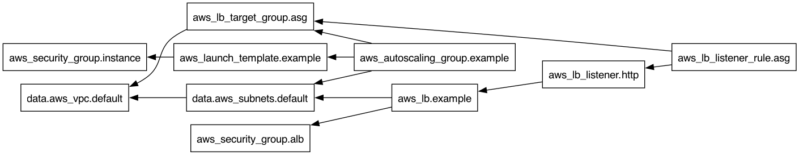

# 第2章 Terraformの基本とWebサーバクラスタ

[リポジトリのトップ](../README.md) | [第3章へ](../ch03/README.md)

記録日: 2026-09-16

> 単一EC2の作成から始め、変数・出力・依存関係を学び、ALBとAuto Scaling Groupを使う構成へ進んだ記録である。既存のAWS CLI用スクリプトをTerraform化することが目的ではない。

## 目次

- [学習内容](#学習内容)
- [基本コマンド](#基本コマンド)
- [単一EC2の作成](#単一ec2の作成)
- [変数と出力](#変数と出力)
- [Webサーバクラスタ](#webサーバクラスタ)
- [Launch Templateへの変更](#launch-templateへの変更)
- [依存関係の可視化](#依存関係の可視化)
- [ミスと対処](#ミスと対処)
- [Gitと開発環境](#gitと開発環境)
- [確認できた結果](#確認できた結果)

## 学習内容

| テーマ | 理解したこと |
| --- | --- |
| 宣言的な管理 | 作成手順を一つずつ書くのではなく、必要な構成をコードで定義する |
| Provider | TerraformがAWSのAPIを操作するためのプラグイン |
| Resource | Terraformで作成・変更・削除する対象 |
| Data source | 既存のVPCなどの情報を読み取る仕組み |
| Variable | 名前・ポートなど、構成に渡す入力値 |
| Output | 作成したリソースの属性などを、外部に公開する出力値 |
| State | Terraformのリソース定義と実際のAWSリソースの対応を管理する情報 |

設定管理ツールは主にサーバ内のパッケージや設定を整え、プロビジョニングツールは主にサーバ・ネットワークなどの基盤を用意するもの、と整理した。ただし、役割には重なる部分もある。

### 現在のコード

- [main.tf](main.tf): Launch Template、ASG、ALB、Security Group、既存VPCの参照
- [variables.tf](variables.tf): ポートやリソース名の入力変数
- [outputs.tf](outputs.tf): ALBのDNS名
- [.terraform.lock.hcl](.terraform.lock.hcl): 使用するProviderの選択結果

現在のコードはクラスタ構成である。最初の単一EC2のコードは、学習過程で置き換えている。

## 基本コマンド

| コマンド | 役割 | 注意点 |
| --- | --- | --- |
| `terraform fmt` | コードの書式を整える | 書式が整っても、引数名が正しいとは限らない |
| `terraform init` | Providerやバックエンドを初期化する | 新しい作業ディレクトリやバックエンド変更時にも必要 |
| `terraform validate` | 設定の構文・内部整合性を検証する | AWS側で作成できることまでは保証しない |
| `terraform plan` | 作成・変更・削除の予定を見る | リソースはまだ作成しない |
| `terraform apply` | 計画を確認して構成を反映する | AWS側の制限で失敗することもある |
| `terraform destroy` | 現在の構成・Stateで管理しているリソースを削除する | アカウント全体の掃除ではない |
| `terraform state list` | Stateに登録された対象を確認する | 部分的な作成失敗後の確認にも使う |

初回の基本的な流れ:

```bash
terraform fmt
terraform init
terraform validate
terraform plan
terraform apply
```

`plan` の `1 to add, 0 to change, 0 to destroy` は「新規作成1件、変更0件、削除0件」という意味である。
`known after apply` は「反映後に値が決まる」という意味で、エラーではない。

`plan -out=...` で保存していない計画は、後の `apply` で再計算される。直前の計画と完全に同じ内容を実行する保証はない。

参考: [Terraform CLI](https://developer.hashicorp.com/terraform/cli/commands)

## 単一EC2の作成

### 認証とリージョン

既存のAWS認証情報を使い、Providerにプロファイルとリージョンを明示した。

```hcl
provider "aws" {
  region  = "us-east-2"
  profile = "terraform-learning"
}
```

AWS CLIのプロファイルはTerraformでも利用できる。アクセスキーをTerraformコードへ書き込む必要はない。
ただし、異なるプロファイル名でも、同じアカウント・同じ権限を使っている場合がある。

### AMIの選択

AMI IDはリージョンごとに異なる。コンソールで `us-east-1` を見ながら、Terraformでは `us-east-2` を指定したため、`InvalidAMIID.NotFound` が発生した。

- コンソールとProviderのリージョンを合わせる。
- `t2.micro` に対応するx86_64のAMIを選ぶ。
- MacがArmであることと、EC2側のCPUアーキテクチャは別の話。
- 書籍や過去のAMI IDが、現在も利用できるとは限らない。

リージョンに合うUbuntu AMIへ変更した後、EC2の起動に成功した。`Name` タグも追加し、コンソール上で反映を確認した。

### Webページの起動

`user_data` で `index.html` を作り、BusyBoxのHTTPサーバを8080番ポートで起動した。
Security GroupでTCP 8080を許可し、ブラウザで `Hello, World` を確認した。

`aws_instance` に `user_data_replace_on_change = true` を設定した際は、User Dataの変更によりEC2が置き換えられた。インスタンスIDやパブリックIPが変わることも確認した。

> `0.0.0.0/0` から8080番ポートを許可したのは書籍の学習用設定である。そのまま本番環境の公開範囲として採用するものではない。

## 変数と出力

**同じディレクトリの `.tf` ファイルは、まとめて一つの構成として読み込まれる。**
`main.tf` が `variables.tf` や `outputs.tf` を呼び出すわけではない。ファイル名は整理のための慣例で、実行順序を決めない。

| 種類 | 例 | 意味 |
| --- | --- | --- |
| 入力変数 | `var.server_port` | HTTPサーバが使うポート番号を受け取る |
| リソース属性 | `aws_lb.example.dns_name` | ALBのDNS名を参照する |
| 出力 | `output "alb_dns_name"` | ALBのDNS名を外部へ公開する |

```hcl
variable "server_port" {
  type    = number
  default = 8080
}

output "alb_dns_name" {
  value = aws_lb.example.dns_name
}
```

`variable` はリソース名だけを受け取るものではなく、ポート・サイズ・フラグなども受け取れる。
`output` も入力変数の値だけを表示するものではなく、作成後に決まる属性や計算結果などを公開できる。
同じ構成内では `output.alb_dns_name` ではなく、元のリソース属性を参照する。

参考: [入力変数](https://developer.hashicorp.com/terraform/language/values/variables)、[出力値](https://developer.hashicorp.com/terraform/language/values/outputs)

## Webサーバクラスタ

単一EC2から、複数のEC2をASGで維持し、ALBで受け付ける構成へ進めた。

```text
ブラウザ
  -> ALB / HTTP:80
  -> Listener / Listener Rule
  -> Target Group / HTTP:8080
  -> ASGが起動・管理するEC2
```

| 構成要素 | 今回の役割 |
| --- | --- |
| Launch Template | AMI、インスタンスタイプ、SG、User Dataを定義する起動設定 |
| Auto Scaling Group | Launch Templateを使い、EC2台数を維持する |
| ALB | ブラウザからのHTTPリクエストを受け付ける |
| Listener | 80番ポートで待ち受ける |
| Listener Rule | パス条件 `*` に一致したリクエストをTarget Groupへ転送する |
| Target Group | EC2への転送先とヘルスチェックを定義する |
| Security Group | ALBの80番、EC2の8080番などの通信を制御する |
| Data source | デフォルトVPCと、そのVPCのサブネットを検索する |

ASGは `min_size = 2`、`max_size = 10` である。最大10台と定義するだけで、負荷に応じたスケーリングポリシーが自動作成されるわけではない。
また、ASGが起動するEC2の台数と、Terraformの `Plan: N to add` のリソース数は別の数え方である。

ALBのデフォルトアクションは404だが、今回のルールは `*` に一致するとTarget Groupへ転送する。
ALB側のSecurity Groupでは、EC2への転送やヘルスチェックのために送信ルールも設定した。

## Launch Templateへの変更

書籍の `aws_launch_configuration` では、このアカウントで作成を拒否された。
現在のAWSの制限に合わせ、`aws_launch_template` に置き換えた。

| Launch Configuration側 | Launch Template側 |
| --- | --- |
| `aws_launch_configuration` | `aws_launch_template` |
| `security_groups` | `vpc_security_group_ids` |
| 通常の文字列の `user_data` | `base64encode(...)` でエンコードした `user_data` |
| ASGの `launch_configuration = ...` | ASG内の `launch_template { ... }` |

```hcl
launch_template {
  id      = aws_launch_template.example.id
  version = "$Latest"
}
```

**Vimでリソース名を一括置換するだけでは足りない。引数名・参照方法・データ形式も変わる。**

`create_before_destroy = true` は、置き換えが必要なときに新しいリソースを先に作る設定である。削除禁止ではない。
現在のコードにはLaunch Configuration時代のコメントが残っているが、Launch Templateへの変更後も同じ意味で「必須」と断定しないように注意する。
また、Launch Templateのバージョン更新だけで、稼働中のEC2が必ず入れ替わるわけではない。

参考: [AWSのLaunch Configuration制限](https://docs.aws.amazon.com/autoscaling/ec2/userguide/launch-configurations.html)、[Provider v4.67.0のLaunch Template仕様](https://github.com/hashicorp/terraform-provider-aws/blob/v4.67.0/website/docs/r/launch_template.html.markdown)、[lifecycle](https://developer.hashicorp.com/terraform/language/meta-arguments/lifecycle)

## 依存関係の可視化

例えば `vpc_security_group_ids = [aws_security_group.instance.id]` と書くと、EC2の起動設定がSecurity Groupに依存していることをTerraformが読み取る。

```bash
terraform graph | dot -Tpng > graph.png
open graph.png
```

Graphvizの `dot` が利用できる環境で、依存関係をPNGにできる。



[画像を開く](graph.png)

**この図は通信経路図ではない。** `A -> B` は「AがBを参照・依存する」という向きである。
削除時は依存する側から片付ける必要があるため、作成時とは逆の順序になる場面がある。

参考: [terraform graph](https://developer.hashicorp.com/terraform/cli/commands/graph)

## ミスと対処

### 環境とProvider

| 症状 | 原因・修正 | 学んだこと |
| --- | --- | --- |
| `InvalidAMIID.NotFound` | 別リージョンのAMIを指定していた。`us-east-2` のx86 AMIに変更 | AMIはリージョンとCPUアーキテクチャを確認する |
| `Inconsistent dependency lock file` | ロックはAWS Provider v6系、制約は `~> 4.0` になっていた | コードのバージョン制約とロックファイルを対応させる |
| `Resource instance managed by newer provider version` | v6で作成したStateをv4で読もうとした | Providerを下げる前にState互換性を確認する |
| `nested_virtualization` の読み取り失敗 | 新しいProviderの属性を古いProviderで扱えなかった | `init -upgrade` だけでは古いProviderでStateを読めるようにはならない |
| Launch Configurationの `UnsupportedOperation` | AWS側の制限で作成不可 | Launch Templateへ変更し、関連引数も修正する |
| `apply` 失敗後もALBなどが残った | 全体が自動でロールバックされるわけではなかった | `terraform state list` で成功済みの対象を確認する |

この学習では、v6.63.0へ戻して既存Stateを読める状態にし、単一EC2とSGの削除計画を確認したうえで2リソースを削除した。その後、書籍のv4系へ戻した。
これは**不要な学習用リソースを削除できる条件で行った対処**である。本番でProviderを下げるために安易にリソースを削除する手順ではない。

`terraform init -upgrade` の「upgrade」は、指定された制約の範囲で選び直すという意味である。制約をv6からv4へ変えれば、選ばれるバージョンが下がる場合もある。

### コードの書き間違い

| 間違い | 修正 |
| --- | --- |
| `aws_instance` の内側に別の `resource` を書いた | リソースブロックを同じ階層に並べる |
| `security_goroups` | `security_groups` |
| `create_before_destroty` | `create_before_destroy` |
| `aws_lanch_configuration` | 当時の参照名を `aws_launch_configuration` に修正。その後Launch Templateへ移行 |
| `loat_balaner_arn` | `load_balancer_arn` |
| `listen_arn` | `listener_arn` |
| ALBリソースがないのに `aws_lb.example` を参照 | `resource "aws_lb" "example"` を追加 |
| Launch Templateで `security_groups` を指定 | `vpc_security_group_ids` に修正 |
| `alb_name` の初期値がポート番号の `8080` | 名前として `"terraform-asg-example"` を指定 |

`alb_name` の数値は文字列へ変換される場合があるため、`validate` が必ず意図の間違いを指摘してくれるとは限らない。ポート用の変数と名前用の変数を区別する。

## Gitと開発環境

- 書籍の手順をそのまま実行して `ch02` 内で `git init` したが、今回は親リポジトリで管理するため、誤って作った子のGit管理を取り除いた。コード本体を消す操作とは別。
- `.terraform.lock.hcl` はGitに含め、State・`.terraform/`・秘密の変数ファイルは含めない。
- `.DS_Store` が意図せずコミットされたため、除外設定と追跡対象の見直しを行った。
- HTTPSのGitHub認証は通常のパスワードではなく、対象リポジトリに絞ったトークンを利用した。値は記録・共有しない。
- コミット用スクリプトに、エラー時停止、変更内容表示、実行前の確認を追加した。

エディターについては、VS CodeのTerraform拡張とVim操作も試した。その後、主に既存のVim環境を使い、`terraform-ls` や補完について学んだ。設定の完全な再現手順やLSP接続状態は、この記録では確認済みとは扱わない。

## 確認できた結果

| 項目 | 記録で確認できた範囲 |
| --- | --- |
| 単一EC2の起動・Nameタグの反映 | AWSコンソールで確認 |
| 単一EC2のWebページ | ブラウザで `Hello, World` を確認 |
| User Data変更によるEC2置き換え | 新旧インスタンスの入れ替わりを確認 |
| Provider復旧後の単一EC2とSGの削除 | `Resources: 2 destroyed` を確認 |
| Launch Templateへの変更 | `validate` 成功、ASGとLaunch Templateの2件追加計画まで確認 |
| クラスタを使う後続の動作確認 | [第3章](../ch03/README.md#確認できた結果)で、DB情報を含むWebページの表示を確認 |

章の終了と、AWSリソースの削除完了は別の確認である。[第3章の後片付け](../ch03/README.md#後片付け)も参照する。

[トップに戻る](#第2章-terraformの基本とwebサーバクラスタ) | [第3章へ](../ch03/README.md)
